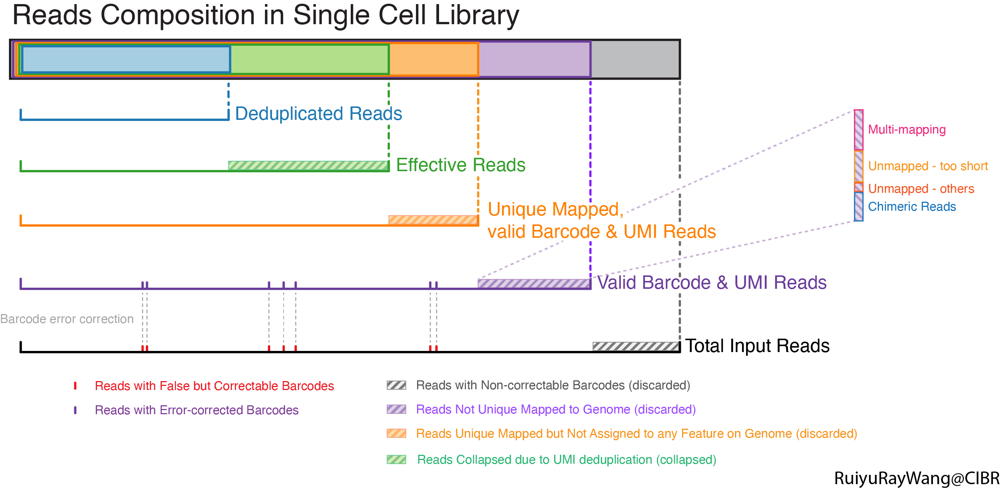

这篇文章是前两篇技术文档的后续：

- [10X CellRanger 中测序饱和度的定义与计算（一）]()
- [10X CellRanger 中测序饱和度的定义与计算（二）]()

上两篇文章成文过程中，我意识到单细胞测序文库从rawdata到deduplicated reads这套分析流程，其实是non-trivial的。Input Raw Reads从下机开始，需经过层层筛选和运算，最终只有少部分信息能保留在表达矩阵（或counts table）中。这里用一张图总结，以帮助我们更好地理解单细胞文库的建库和上游分析（Upstream Analysis）。

***

{}

***

本文以[ScRNAseq_smkpipe_at_Luolab](https://github.com/RuiyuRayWang/ScRNAseq_smkpipe_at_Luolab)为例。该方法的Chemistry和[10X v2/v3的Chemistry](https://teichlab.github.io/scg_lib_structs/methods_html/10xChromium3.html)可能非常相似，引入了cell barcode和UMI，但二者在某些技术实现上有些不同，具体是哪些区别与本文无关，在此不再赘述。
